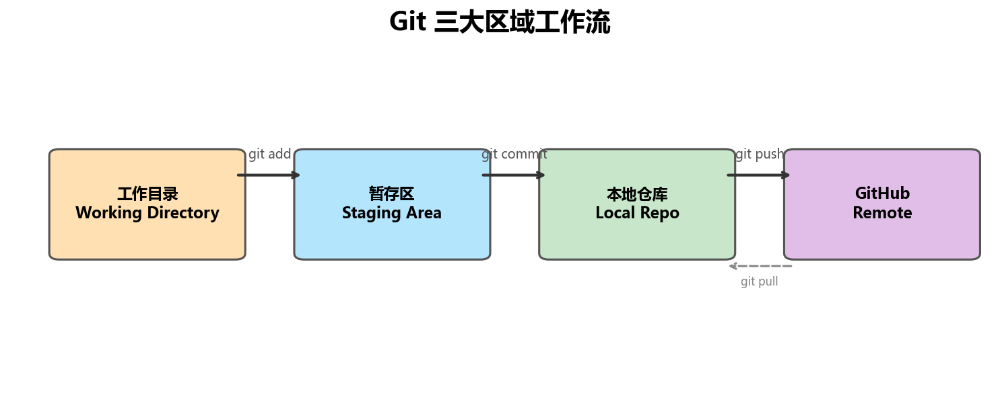
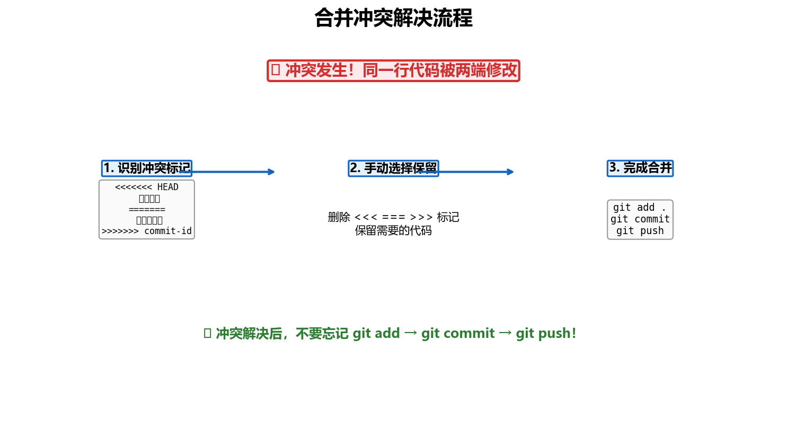
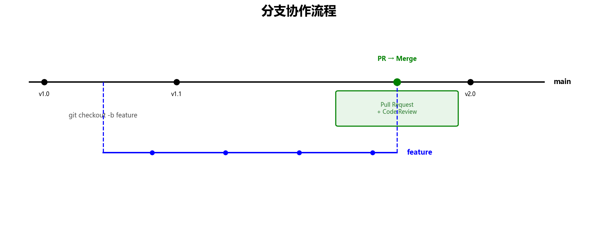

# 🚀 Git + GitHub 完全入门指南

> **适合人群**：零基础，想从零开始学会 Git 和 GitHub 协作开发。
> **预计时间**：通读 20 分钟，跟着敲一遍 30-40 分钟。
> **配套文件**：同目录下 `Git速查卡.md` 是速查卡，学完后日常翻阅用。

---

## 目录

1. [先搞懂：Git 和 GitHub 是什么](#1-先搞懂git-和-github-是什么)
2. [准备工作：安装与配置](#2-准备工作安装与配置)
3. [SSH 密钥：打通本地和云端](#3-ssh-密钥打通本地和云端)
4. [仓库管理：创建与克隆](#4-仓库管理创建与克隆)
5. [日常工作流：修改、提交、推送](#5-日常工作流修改提交推送)
6. [拉取代码与处理冲突](#6-拉取代码与处理冲突)
7. [分支协作开发](#7-分支协作开发)
8. [常用命令速查表](#8-常用命令速查表)
9. [常见问题 FAQ](#9-常见问题-faq)
10. [协作实战：完整流程图](#10-协作实战完整流程图)

---

## 1. 先搞懂：Git 和 GitHub 是什么

### 一句话区分

| 工具 | 是什么 | 类比 |
|------|--------|------|
| **Git** | 版本控制工具，装在你电脑上 | 你电脑里的"时光机" + "存档系统" |
| **GitHub** | 代码托管网站，在云端 | 放代码的"百度网盘" + "社交平台" |

### Git 帮你解决什么问题？

你有没有过这种经历：

```
毕业论文_v1.doc
毕业论文_v2.doc
毕业论文_最终版.doc
毕业论文_最终版2.doc
毕业论文_打死不改版.doc
```

Git 就是来解决这个问题的——**自动、干净地记录每一次修改**，随时能回到任何历史版本，不用摆一桌子的副本文件。

### GitHub 帮你解决什么问题？

- 代码备份在云端，电脑坏了也不怕
- 多人协作：你和同事同时改一个项目，互不干扰
- 参与开源：全世界的开发者都在上面分享代码

### Git 三大区域（核心概念）



你的代码流转路径：

```
工作目录          暂存区 (Stage)        本地仓库            GitHub
(写代码)    →    (git add 收集)   →   (git commit 确认) → (git push 上传)
```

> 🔑 **关键理解**：Git 有三个"存放位置"，不是一步到位。先 `add`（加入购物车），再 `commit`（确认买单），最后 `push`（带回家）。做错了可以在每一步撤销，很安全。

---

## 2. 准备工作：安装与配置

### 2.1 检查 Git 是否已安装

打开终端（Windows 上推荐用 **Git Bash**，安装 Git 时会自带）：

```bash
git --version
```

如果显示类似 `git version 2.54.0` 则已安装。如果没有，去 [git-scm.com](https://git-scm.com) 下载安装（一路点 Next 就行）。

### 2.2 配置用户信息

Git 每次提交都会记录**谁**做的，必须先告诉它你是谁：

```bash
git config --global user.name "你的名字"
git config --global user.email "你的邮箱"
```

> 💡 `--global` 表示全局生效，对所有项目都有效。如果你想某个项目用不同的名字，去掉 `--global` 就行。

### 2.3 检查配置

```bash
git config --global --list
# 会显示你设置的用户名和邮箱
```

---

## 3. SSH 密钥：打通本地和云端

### 3.1 为什么要配 SSH？

| 方式 | 体验 |
|------|------|
| HTTPS | 每次 push/pull 都要输密码，很烦 |
| **SSH（推荐）** | 配置一次，以后再也不用输密码 |

### 3.2 生成密钥

```bash
ssh-keygen -t ed25519 -C "你的邮箱"
# 看到提示直接按回车就行（不设密码，省事）
# 看到提示再按一次回车（确认不设密码）
```

这会生成两个文件：
- `~/.ssh/id_ed25519` — **私钥**（你的钥匙，自己保管，不要发给任何人）
- `~/.ssh/id_ed25519.pub` — **公钥**（锁，放在 GitHub 上）

> 🍳 **类比**：私钥是你家的钥匙（自己保管），公钥是你家的门锁（装在外面的）。有钥匙的人能开这个锁。

### 3.3 复制公钥

```bash
cat ~/.ssh/id_ed25519.pub
```

把输出的一大串字符（以 `ssh-ed25519` 开头）全部复制下来。

### 3.4 添加到 GitHub

1. 打开 https://github.com/settings/keys
2. 点击 **"New SSH key"**
3. Title：随便起名，比如 "我的电脑"
4. Key：把上一步复制的公钥粘贴进去
5. 点击 **"Add SSH key"**

### 3.5 测试连接

```bash
ssh -T git@github.com
# 看到 "Hi 你的用户名! You've successfully authenticated..." 就是成功了
```

---

## 4. 仓库管理：创建与克隆

先搞清楚两个概念：

| 概念 | 说明 |
|------|------|
| **Repository（仓库/Repo）** | 一个项目的 Git 管理空间，包含所有文件和版本历史 |
| **Fork** | 把别人的仓库复制一份到你自己的 GitHub 账号下 |
| **Clone** | 把 GitHub 上的仓库下载到你本地电脑 |

### 场景一：本地已有代码 → 推送到 GitHub

```bash
# 1. 进入你的项目目录
cd 你的项目文件夹

# 2. 初始化 Git 仓库（告诉 Git 开始管理这个目录）
git init

# 3. 创建 .gitignore（告诉 Git 哪些文件不用管）
#    比如 Python 项目可以写: echo "__pycache__/" > .gitignore

# 4. 暂存所有文件（加入购物车）
git add .

# 5. 提交到本地仓库（确认买单）
git commit -m "首次提交"

# 6. 去 GitHub 网页上新建一个空仓库
#    ⚠️ 注意：不要勾选 README、.gitignore、License

# 7. 关联远程仓库（告诉 Git：云端地址是这个）
git remote add origin git@github.com:你的用户名/仓库名.git

# 8. 推送代码到 GitHub
git push -u origin main
```

> 💡 `-u` 的意思是"记住这个上游"，之后直接敲 `git push` 就行，不用每次都跟 `origin main`。

### 场景二：GitHub 已有仓库 → 下载到本地

```bash
git clone git@github.com:用户名/仓库名.git
cd 仓库名
# 已经自动关联好了，直接开始写代码
```

### Fork vs Clone

| 操作 | 用途 | 场景 |
|------|------|------|
| **Fork** | 在 GitHub 上把别人的仓库复制到你自己的账号 | 想给开源项目贡献代码 |
| **Clone** | 把仓库下载到本地电脑 | 想在自己电脑上开发 |

---

## 5. 日常工作流：修改、提交、推送

这是你**每天用得最多**的操作，就四步：

```bash
# 第一步：查看当前状态（最最最常用的命令！随时敲，安全无害）
git status

# 第二步：暂存修改（加入购物车）
git add <文件名>      # 只暂存某个文件
git add .             # 暂存所有修改

# 第三步：提交到本地仓库（确认买单）
git commit -m "描述你做了什么"

# 第四步：推送到 GitHub（带回家）
git push origin main
```

### 提交信息怎么写？

```bash
# ✅ 好的提交信息——别人（和一个月后的你自己）一看就懂
git commit -m "feat: 添加用户登录功能"
git commit -m "fix: 修复首页图片加载失败的bug"
git commit -m "docs: 更新 README 安装步骤"

# ❌ 避免——没人知道做了什么
git commit -m "修改"
git commit -m "111"
git commit -m "update"
```

**前缀规范**（业内通用）：

| 前缀 | 含义 | 举例 |
|------|------|------|
| `feat` | 新功能 | `feat: 添加搜索功能` |
| `fix` | 修 Bug | `fix: 修复登录失败` |
| `docs` | 文档 | `docs: 更新 API 说明` |
| `refactor` | 重构代码 | `refactor: 简化用户验证逻辑` |
| `style` | 格式调整 | `style: 统一代码缩进` |
| `chore` | 杂项 | `chore: 更新依赖版本` |

---

## 6. 拉取代码与处理冲突

### 6.1 拉取远端的两种方式

```bash
# 方式一：只下载，不合并（更安全——先看看别人改了什么）
git fetch origin

# 方式二：下载 + 自动合并（一步到位）
git pull origin main
```

> 🎯 **关系**：`git pull` = `git fetch` + `git merge`。新手直接用 `pull` 就行，等你需要更精细的控制时再用 `fetch`。

### 6.2 什么时候会冲突？

当**你和别人**（或者**你在两台电脑上**）修改了**同一个文件的同一行**，Git 不知道该保留谁的，就产生冲突。

> ⚠️ **冲突不可怕**！它只是 Git 在问你：「两个版本不一样，你来决定保留哪个？」

### 6.3 冲突解决三步走



**第一步：找到冲突标记**

冲突文件里会出现这样的标记：

```
<<<<<<< HEAD
你的改动
=======
别人的改动
>>>>>>> commit-id
```

- `<<<<<<< HEAD` 到 `=======` 之间：**你本地的版本**
- `=======` 到 `>>>>>>> xxx` 之间：**远端的版本**

**第二步：手动选择**

删掉标记符号，只保留你需要的代码。也可以把两边的改动合并起来。

**第三步：完成合并**

```bash
git add .                          # 标记"冲突已解决"
git commit -m "merge: 解决冲突"     # 提交合并结果
git push origin main               # 推送到 GitHub
```

---

## 7. 分支协作开发

### 7.1 什么是分支？为什么需要？



> 🍳 **类比**：`main` 分支是正式发布的产品。每次开发新功能，你从 `main` 复制一份出来，在新副本上折腾——这就是"创建分支"。折腾好了再合并回去。折腾期间完全不打扰主产品。

- **`main` / `master`**：主分支，永远保持稳定可用的状态
- **`feature-xxx`**：功能分支，开发新东西的地方

### 7.2 分支操作完整流程

```bash
# 1. 确保本地的 main 是最新的
git checkout main
git pull origin main

# 2. 创建并切换到新分支（以开发"登录功能"为例）
git checkout -b feature-login

# 3. 在新分支上写代码、提交（和日常流程一样）
git add .
git commit -m "feat: 完成登录页面"
git add .
git commit -m "feat: 完成登录验证逻辑"

# 4. 把新分支推送到 GitHub
git push -u origin feature-login
```

### 7.3 在 GitHub 上创建 Pull Request（PR）

PR 就是「请求别人把你分支上的改动合并到 main」。

1. 打开你的 GitHub 仓库页面 → 通常会看到醒目的 **"Compare & pull request"** 按钮
2. 确认方向：`base: main` ← `compare: feature-login`
3. 写清楚你做了什么改动（好的 PR 描述能让 reviewer 快速理解）
4. 点击 **"Create pull request"**
5. 等队友审查（Code Review）后 → 点击 **"Merge pull request"**

### 7.4 合并后清理

```bash
git checkout main                      # 切回主分支
git pull origin main                   # 把合并后的最新代码拉到本地
git branch -d feature-login            # 删除本地分支（已经合并了，不需要了）
git push origin --delete feature-login # 删除远端分支
```

### 7.5 分支命令速查

| 命令 | 作用 |
|------|------|
| `git branch` | 查看所有本地分支 |
| `git branch -a` | 查看所有分支（含远端） |
| `git checkout -b <name>` | 创建并切换到新分支 |
| `git checkout <name>` | 切换到已有分支 |
| `git merge <name>` | 将 `<name>` 分支合并到当前分支 |
| `git branch -d <name>` | 删除本地分支 |

---

## 8. 常用命令速查表

### 基础配置

```bash
git config --global user.name "..."    # 设置用户名
git config --global user.email "..."   # 设置邮箱
git remote -v                          # 查看远端仓库地址
git remote add origin <url>            # 添加远端仓库
```

### 日常高频

```bash
git status                # 🔥 查看当前状态（随时用！）
git diff                  # 查看改了什么具体内容
git add <file>            # 暂存指定文件
git add .                 # 暂存所有修改
git commit -m "..."       # 提交到本地仓库
git push origin main      # 推送到 GitHub
git pull origin main      # 从 GitHub 拉取最新代码
```

### 历史查看

```bash
git log --oneline             # 精简版历史（一行一条）
git log --oneline --graph     # 🔥 带分支图的树状历史（强烈推荐）
git log --all --graph         # 查看所有分支的历史
```

### 撤销与回退

```bash
git restore <file>              # 撤销工作区的修改（回到上次 commit 的状态）
git restore --staged <file>     # 取消暂存（从购物车拿出来）
git reset --soft HEAD~1         # 撤销最近一次 commit（保留你的修改）
git reset --hard HEAD~1         # 彻底撤销最近一次 commit（修改也扔掉，⚠️ 谨慎）
```

### 分支管理

```bash
git branch                     # 查看本地分支
git checkout -b <name>         # 新建 + 切换分支
git checkout main              # 切换到主分支
git merge <name>               # 合并分支到当前分支
git branch -d <name>           # 删除本地分支
git push origin --delete <name> # 删除远端分支
```

---

## 9. 常见问题 FAQ

### Q1：`git push` 时提示 "Permission denied (publickey)"

**原因**：SSH 密钥没配好或者没添加到 GitHub。

**解决**：
```bash
ssh -T git@github.com   # 先测试连接是否正常
```
如果失败，重新检查第 3 步的 SSH 配置。

---

### Q2：忘记 `.gitignore`，不小心上传了不该传的文件怎么办？

```bash
# 1. 先添加到 .gitignore
echo "文件名" >> .gitignore

# 2. 从 Git 跟踪中移除（但保留本地文件，不删除）
git rm --cached 文件名

# 3. 提交并推送
git add .gitignore
git commit -m "chore: 更新 .gitignore"
git push
```

---

### Q3：提交了错误的 commit 信息，能改吗？

```bash
# 修改最近一次提交的信息
git commit --amend -m "正确的提交信息"

# 如果已经推送了，需要强制推送（⚠️ 团队协作中要谨慎，先和队友沟通）
git push --force-with-lease
```

---

### Q4：`main` 和 `master` 有什么区别？

**没有技术上的区别**，只是名称不同。Git 2.28 版本后默认用 `main`，GitHub 也已经将默认分支名改为 `main`。你可能会在旧项目中看到 `master`。

---

### Q5：如何回退到某个历史版本看一看？

```bash
# 查看历史，找到目标 commit 的 id（那串哈希值）
git log --oneline

# 临时切到那个版本（不破坏历史）
git checkout <commit-id>

# 看完回到最新
git checkout main
```

---

### Q6：如何彻底回退到某个历史版本？

```bash
# 回退到指定 commit，保留之后的修改在工作区（后悔了还能看）
git reset --soft <commit-id>

# 回退到指定 commit，丢弃所有之后的修改（⚠️ 不可恢复，确认了再用）
git reset --hard <commit-id>
```

---

### Q7：怎么同时开发多个功能？

开多个分支！每个功能一个分支，互不干扰：

```bash
git checkout -b feature-A    # 开发功能 A
git checkout main
git checkout -b fix-bug      # 修 Bug
# 两个分支独立开发，各自提 PR，合并后再切回来继续
```

---

### Q8：未跟踪文件和已跟踪文件的区别是什么？

这是 Git 里最容易困惑的概念之一：

| 状态 | 含义 | 特点 |
|------|------|------|
| **未跟踪 (Untracked)** | 新文件，Git 还没开始管理 | 不属于任何分支，在所有分支都可见 |
| **已跟踪 (Tracked)** | Git 已经在管理的文件 | 属于特定分支，在不同分支有不同版本 |

> 🎯 **简单记**：`git add` 过的文件就是"已跟踪"。`.gitignore` 里的文件不会被跟踪。
>
> Git **只管理已跟踪的文件**，未跟踪的文件就像空气一样被 Git 忽略。

---

## 10. 协作实战：完整流程图

```
                        ┌──────────────┐
                        │  git clone   │
                        │  或 git init │
                        └──────┬───────┘
                               │
                        ┌──────▼───────┐
                        │ 创建功能分支  │
                        │ checkout -b  │
                        └──────┬───────┘
                               │
                        ┌──────▼───────┐
                        │   写代码      │◄──────────┐
                        └──────┬───────┘           │
                               │                   │
                        ┌──────▼───────┐           │
                        │   git add    │           │
                        │   git commit │           │
                        └──────┬───────┘           │
                               │                   │
                        ┌──────▼───────┐           │
                        │   git push   │           │
                        └──────┬───────┘           │
                               │                   │
                        ┌──────▼───────┐           │
                        │ GitHub 创建  │           │
                        │ Pull Request │           │
                        └──────┬───────┘           │
                               │                   │
                        ┌──────▼───────┐     ┌─────┴──────┐
                        │  Code Review │─────→│  需要修改   │
                        └──────┬───────┘     └────────────┘
                               │ 通过
                        ┌──────▼───────┐
                        │  Merge 到    │
                        │    main      │
                        └──────┬───────┘
                               │
                        ┌──────▼───────┐
                        │ 切回 main    │
                        │ git pull     │
                        │ 删功能分支    │
                        └──────┬───────┘
                               │
                        ┌──────▼───────┐
                        │   ✅ 完成！  │
                        └──────────────┘
```

---

> 📌 **最后记住一句话**：Git 不可怕，它就是一个 **"自动帮你记录代码变化"** 的工具。
>
> 多用 `git status` 看看自己在哪，多用 `git log --oneline --graph` 看看历史长什么样，你很快就能建立直觉。
>
> 搞砸了也别慌——只要代码 commit 过，Git 就能帮你找回来。
